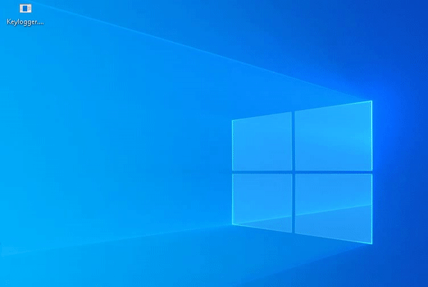

# C and C++ Lab

Historical C/C++ learning projects. The current tree contains a **Windows keyboard-event capture experiment** with a Code::Blocks project, source code, and previously built artifacts.

## Included project

| Path | Purpose |
| --- | --- |
| [Keylogger/main.cpp](Keylogger/main.cpp) | Windows keyboard-state polling and text-file output. |
| [Keylogger/Keylogger.cbp](Keylogger/Keylogger.cbp) | Code::Blocks project configuration. |

The source uses `windows.h`, `winuser.h`, and `GetAsyncKeyState`. It hides the console at startup and continuously appends captured keys to `score.txt` in the process's working directory. It is not limited to typing inside an application window.

## Review and runtime scope

Start by inspecting the source in an editor. Compilation requires a compatible Windows C++ toolchain; this is not a portable Linux or macOS example. The committed executable and object files are historical outputs, not newly verified builds.

Any runtime study should be limited to an explicitly consented test environment without sensitive input. The loop has no documented in-app stop control; terminating the process ends capture. This documentation update did not compile or execute the capture program.

## Original demonstration

## Project status

There is no automated test suite or reproducible build pipeline. Future maintenance could separate key mapping from capture for testing, add visible capture state and explicit start/stop controls, and keep generated binaries outside source control. No capture or concealment behavior was changed in this documentation update.
